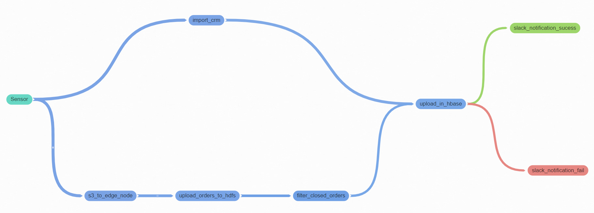

# **Customer 360**

## Problem Statement :

A daily task requires filtering closed orders against customers. Customer info is in a MySQL database, while closed orders are provided in a CSV file within an S3 bucket between 5pm-6pm. The task is to wait for the file, filter the closed orders, join them with customer CRM details, and send the data to the analytics team. Success or failure notifications will be sent via Slack

## Solution Approach

1. Will wait for the csv orders file to be available in the S3 bucket. HTTP sensor will be used. : sensor
2. Once the file is available Download the S3 files into local (edge node) : s3_to_edge_node
3. Sqoop to fetch CRM Customer info from MySql to hive (edge node) : import_crm
4. Upload  S3 order files into HDFS : upload_orders_to_hdfs
5. Spark program to filter the data from HDFS on closed. < spark jar > < input path > < o/p path > : filter_closed_orders
6. create hive table from spark < o/p path > : create_order_hive_table
7. Upload it into HBASE (HBASE Hive Connector) : upload_in_hbase
8. Slack channel for communication/ notification on  Success/ Failure : slack_notification_sucess, slack_notification_fail

> **Tech stack :** Airflow, HBASE, SPARK, HIVE, SQOOP, MySQL

