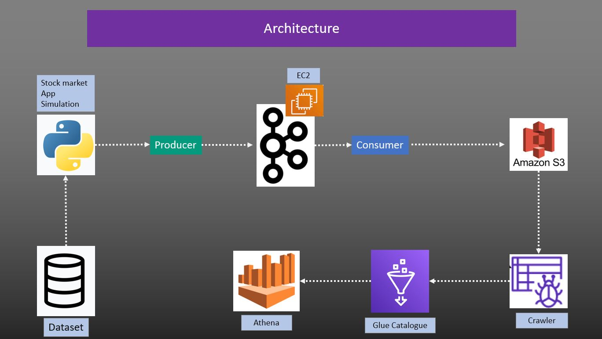
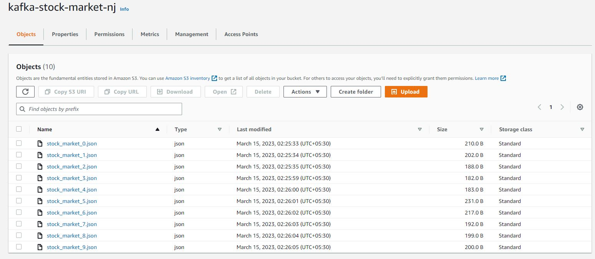
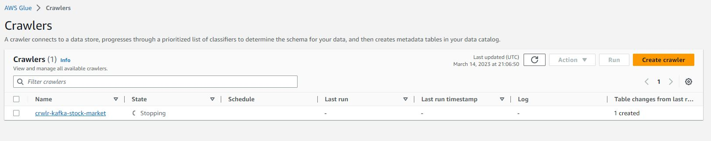
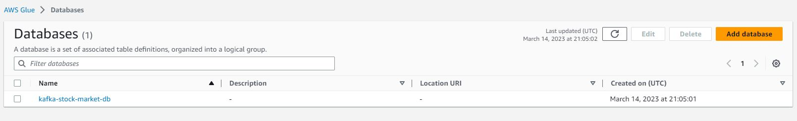
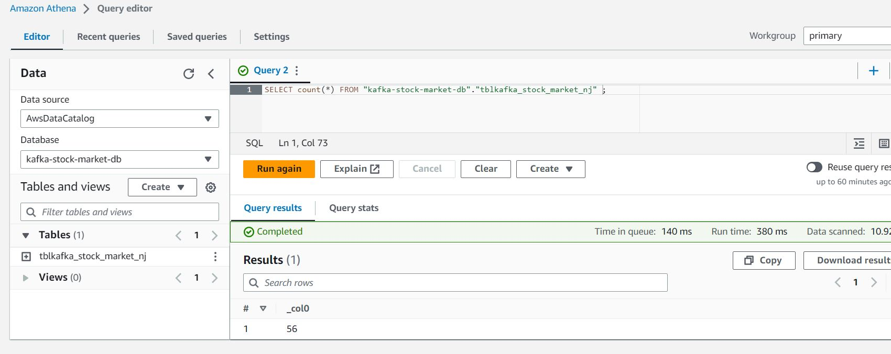
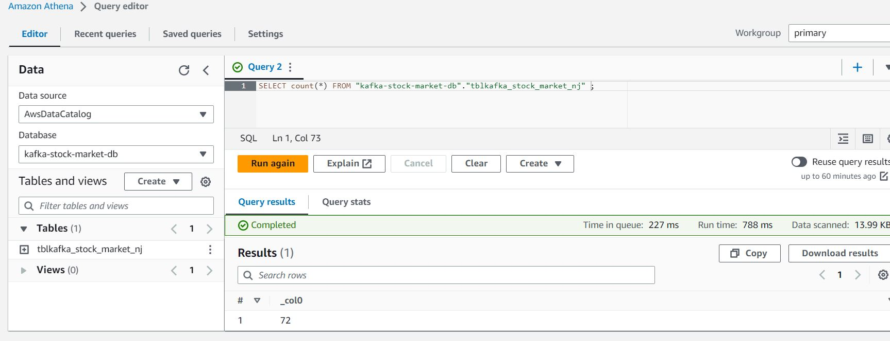

# Stock Market Real Time Data Management

In this stock market real time data management project we have simulated real time data producer using python, sent this information to kafka running on an EC2 instance and used S3 bucket as a consumer to query real time analytics via Glue and Athena.

## Architecture :

---


Here we have :

- simulated the stockmarket data generation via python
- Ingested data packet is going to kafka running on EC2 instance.
- This data packet is transformed and stored in Amazon S3 .
- Then we are using a crawler to infer the schema in AWS Glue
- With this infer schema we are running realtime query on S3 using Amazon Athena to derive insights

## **Step 1 : Setting Up EC2 & Kafka & AWS CLI Authentication**

---

First we have created the EC2 Free tier instance with the below

- security group : stock-market-kafka-sg
- key-pair : kp-stock-market-kafka
- EC2 : stock-market-kafka
- public IP : 3.110.170.6

Now we are getting into the EC2 instance via SSH.

Now We need to install kafka on this EC2 . We need to run wget command with the binary .tgz file. we can get the kafka from official kafka website [kafka download](https://kafka.apache.org/downloads)

> **wget https://archive.apache.org/dist/kafka/3.3.1/kafka_2.12-3.3.1.tgz**

Now to unpack this file

> **tar -xvf kafka_2.12-3.3.1.tgz**

**Note :** Kafka runs on java

In our EC2 we do not have java already installed. To install Java

> **sudo yum install java-1.8.0-openjdk**

Now we'll start Zookeeper

```bash
cd kafka_2.12-3.3.1/
bin/zookeeper-server-start.sh config/zookeeper.properties
```

Increase the memory of the kafka server as I am running a single EC2 (in a different terminal window after logging into the EC2)

> **export KAFKA_HEAP_OPTS="-Xmx256M -Xms128M"**

Now we'll start Kafka server

```bash
cd kafka_2.12-3.3.1/
bin/kafka-server-start.sh config/server.properties
```

This kafka is running by default private IP as per all AWS services internally.


I am going to change this ip to the public ip with the security inbound rule added to do a connetion from my IP via internet as I am using my python script as a producer and sending info to this kafka server.


I am going to edit the **config/server.properties** file

```bash
sudo nano config/server.properties
```

> change the **ADVERTISED_LISTENERS** to public IP
> 

Now Kafka should run on public IP (not a good Practice)


**Create a Topic** (in another terminal sshed into the EC2)

> **Topic Name :** kafka-stock-market

```bash
cd kafka_2.12-3.3.1
bin/kafka-topics.sh --create --topic kafka-stock-market --bootstrap-server 52.66.210.202:9092 --replication-factor 1 --partitions 1
```

**Start Producer** (In Topic's terminal )

> bin/kafka-console-producer.sh --topic kafka-stock-market --bootstrap-server 52.66.210.202:9092

**Start Consumer** (in another terminal sshed into the EC2)

> bin/kafka-console-consumer.sh --topic kafka-stock-market --bootstrap-server 52.66.210.202:9092

**AWS CLI Configuration :** Since I am going to push data from my PC/IP to EC2 I need to authenticate it via access key


## **Step 2 : Setting Up S3 Bucket**

---

Created 2 S3 buckets

- **kafka-stock-market-nj :** Here the consumer pushes the information
- **athena-store-kafka-stock-market-nj :** Here Athena pushes the queried results


## **Step 3 : Setting Up python producer & consumer in my PC ( simulating realtim data ingestion )**

---

**Creating Producer :**

```python
# importing Libs
import pandas as pd
from time import sleep
from json import dumps
import json
from kafka import KafkaProducer

# producer object
producer = KafkaProducer(bootstrap_servers=['52.66.210.202:9092'],  # public Ip in EC2 ==> 52.66.210.202
                         value_serializer=lambda x: dumps(x).encode('utf-8'))

# Reading stock market data from  csv file
df = pd.read_csv('data.csv')

# taking a sample random line to push to kafka
dict_stock = df.sample(1).to_dict(orient= "records")[0]

# Pushing this random data packet to kafka
while True:
    dict_stock = df.sample(1).to_dict(orient="records")[0]
    producer.send('kafka-stock-market',value = dict_stock) # kafka-stock-market is the topic name
    sleep(1) # sleep so that the kafka & zookeeper doesnot get over loaded as I am running  t2 micro EC2

```

**Creating Consumer :**

```python
# importing Libs
from kafka import KafkaConsumer
from time import sleep
from json import dumps,loads
import json
from s3fs import S3FileSystem

# Consumer object
consumer = KafkaConsumer(
    'kafka-stock-market',
     bootstrap_servers=['52.66.210.202:9092'],  # public Ip in EC2 ==> 52.66.210.202
    value_deserializer=lambda x: loads(x.decode('utf-8')))

# S3 Object
s3 = S3FileSystem()

# taking a sample random line to push to kafka
dict_stock = df.sample(1).to_dict(orient= "records")[0]

# Consuming this procucer data by pushing to S3
for file_no, data in enumerate(consumer):
    with s3.open("s3://kafka-stock-market-nj/stock_market_{}.json".format(file_no), 'w') as file:
        json.dump(data.value, file)

```

Once we start the consumer and Producer each json dictionary will go to the S3 bucket as individual files.



## **Step 4 : Setting up Crawler and Athena**

---

Let's Create a on demand crawler in Glue **crwlr-kafka-stock-market**



Now need to create a database



> **Now need to create a role in AWS to connect S3 & Glue .**

Now we need to run the crawler once we have some input in the S3 bucket (**kafka-stock-market-nj**)

Once the table is created via the crawler we'll go to Athena ( storing queried results in **athena-store-kafka-stock-market-nj** )


Now we'll start the consumer & producer again ( after making sure the kafka & Zookeeper is still running )

In Athena I have the query to see the real time Analytics



Then after sometime run the same query and the data has been updated

