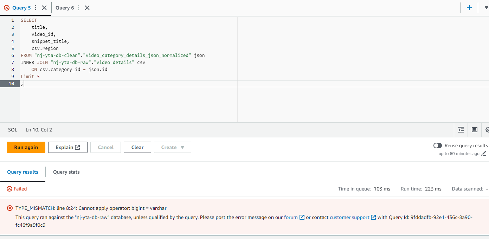
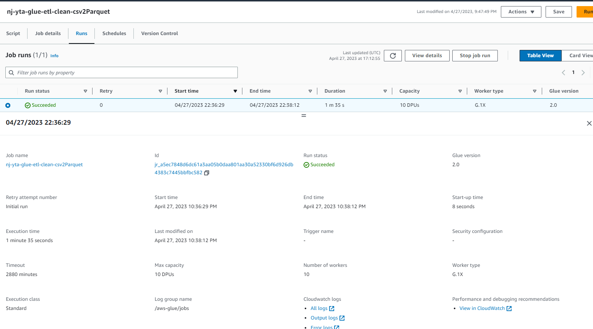
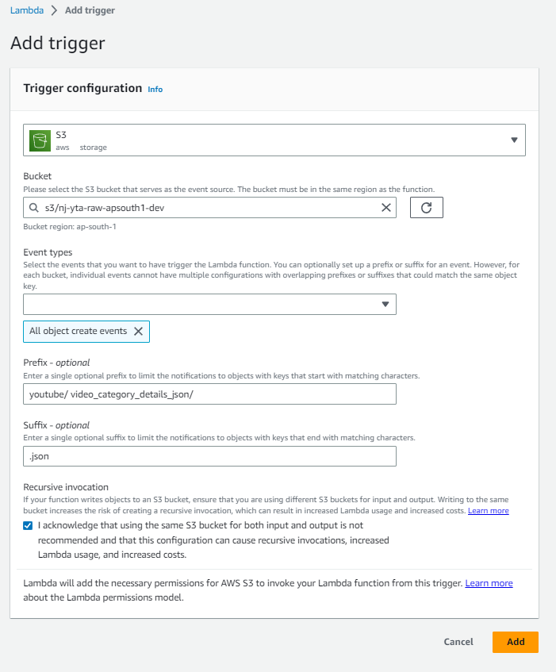
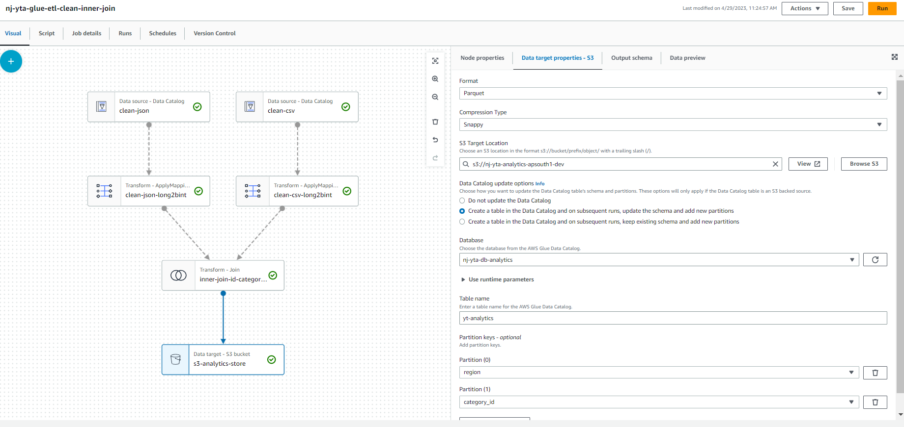

# Problem Statement
The YouTube analysis data set readiness for insights analysis

## **Info Available :**
This dataset includes several months (and counting) of data on daily trending YouTube videos. Data is included for the US, GB, DE, CA, and FR regions (USA, Great Britain, Germany, Canada, and France, respectively), with up to 200 listed trending videos per day.
Now includes data from RU, MX, KR, JP and IN regions (Russia, Mexico, South Korea, Japan and India respectively) over the same time period.

Each region’s data is in a separate file. Data includes the video title, channel title, publish time, tags, views, likes and dislikes, description, and comment count.

The data also includes a category_id field, which varies between regions. To retrieve the categories for a specific video, find it in the associated JSON. One such file is included for each of the five regions in the dataset.

---
# Solution Approach

1. Raw data will be stored into S3 bucket raw. 
2. From there with the help of Glue Catalog and AWS Lambda data will be preprocessed for the Analytics layer.
3. Final data will be stored in optimal parquet format for Presentation layer with the help of AWS Redshift and Athena.
4. The information will then be visualized in AWS QuickSight for insights
5. The  Solution Architecture is as follows


---

# **Solution Implementation**

## **Step 1 : Getting the data into the Data Lake :**
1. Get the data from kaggle : [YouTube Data Analysis](https://www.kaggle.com/datasets/datasnaek/youtube-new)
2. Create an S3 bucket : `nj-yta-raw-apsouth1-dev`
3. Unzip the downloaded Kaggle data and let's get into that folder via command prompt.
4. Upload the data into the S3 bucket using AWS CLI Commands. So  AWS CLI should be installed and the configuration should be set at this point with the IAM user secret key with S3 Access.
5. We can run the below command to see the existing S3 buckets :
`aws s3 ls`

    

6. Now I can go into the data dir and  run the below command to push the .json files (video category details) into S3-RAW layer : 
```bash
aws s3 cp . s3://nj-yta-raw-apsouth1-dev/youtube/video_category_details_json/ --recursive --exclude "*" --include "*.json"
```

This will create a folder in `nj-yta-raw-apsouth1-dev` S3 bucket and store the video category details(json files) into it.

  

  

7. Next we need to load the CSV files that contains individual video details into the S3 raw layer. These information is partitioned based on region. So, we'll store it in the same way.

```bash
aws s3 cp CAvideos.csv s3://nj-yta-raw-apsouth1-dev/youtube/video_details/region=ca/
aws s3 cp DEvideos.csv s3://nj-yta-raw-apsouth1-dev/youtube/video_details/region=de/
aws s3 cp FRvideos.csv s3://nj-yta-raw-apsouth1-dev/youtube/video_details/region=fr/
aws s3 cp GBvideos.csv s3://nj-yta-raw-apsouth1-dev/youtube/video_details/region=gb/
aws s3 cp INvideos.csv s3://nj-yta-raw-apsouth1-dev/youtube/video_details/region=in/
aws s3 cp JPvideos.csv s3://nj-yta-raw-apsouth1-dev/youtube/video_details/region=jp/
aws s3 cp KRvideos.csv s3://nj-yta-raw-apsouth1-dev/youtube/video_details/region=kr/
aws s3 cp MXvideos.csv s3://nj-yta-raw-apsouth1-dev/youtube/video_details/region=mx/
aws s3 cp RUvideos.csv s3://nj-yta-raw-apsouth1-dev/youtube/video_details/region=ru/
aws s3 cp USvideos.csv s3://nj-yta-raw-apsouth1-dev/youtube/video_details/region=us/
```

  

  

  

> **This concludes the dumping the data into the S3 Data lake.**


---

## **Step 2 : Creating a Glue Catalog to get the json Schema :**

1. Create an On Demand Crawler along with a database for RAW S3 Bucket Tables. This Crawler's purpose is to crawl through the json files located at `s3://nj-yta-raw-apsouth1-dev/youtube/video_category_details_json/`  and create the data schema and store it in the RAW table for further use.
    - **Crawler** : `nj-yta-glue-catalog-raw-json`
    - **DataSource Crawling** : `s3://nj-yta-raw-apsouth1-dev/youtube/video_category_details_json/`
    - **Database** : `nj-yta-db-raw`
    - **IAM** : `nj-yta-raw-glue-s3-glueService`

    
2. Run the crawler


3. After the run we can find table created under db `nj-yta-db-raw`. Since it is crawling final folder `video_category_details_json` the table name is `video_category_details_json`

    

This table contains the json files schema

  

The 'array' schema as follows

  

4. Now we come to **AWS Athena** to run adhoc query to check the data that we have.This querywill be done from the table `nj-yta-db-raw.video_category_details_json` table. Before we query the data we need to add an S3 bucket in the Athena settings to store the logs so that we can troubleshoot later if any issue happens. for that w'll create another bucket `nj-yta-raw-athena-logs` in the same Region.

    

5. Once Bucket is created this needs to be added in **AWS Athena**

    

    

6. Once Athena is configured now I can come and fire the below adhoc query to test the data

```bash
SELECT * FROM "nj-yta-db-raw"."video_category_details_json" limit 10;
```
7. Once I'll run this I should be able to see the results. But we'll get an error.
This error is due to the file SERDE properties.

    

> **Reason For HIVE_CURSOR_ERROR:**

JSON records in data files must appear one per line, an empty line would produce a NULL record. This is because Hadoop partitions files as text using CR/LF as a separator to distribute work.
>> CR and LF are control characters, respectively coded 0x0D (13 decimal) and 0x0A (10 decimal). These are used to mark a line break in a text file.

The following example will work.
```json
{ "key" : 10 }
{ "key" : 20 }
```
The following example will not work.
```json
{
  "key" : 10
}
{
  "key" : 20
}
```
---
## **Step 3 : Creating a AWS Lambda to get the Clean json schema and make it a flat table :**

To rectify these errors we need to understand our data and exactly which data is needed and we need to build a custom **AWS Lambda** function to get it from the json, then store it into another S3 bucket and then run crawler on top of it to query it. 


1. Let's start by creating one S3 bucket to store the clean data : `nj-yta-clean-apsouth1-dev`

    

2. Next step will be to create the database to store the clean data in the form of tables : `nj-yta-db-clean`

    

3. Next step will create one **AWS Lambda** function with the code available in _[lambda-function.py](./lambda-function.py)_. At this point we need to have a role to interact between Lamda and S3

    - **Function Name :** `nj-yta-raw2clean-apsouth1-lambda-json2parquet`  
    - **Runtime :** _Python 3.8_  
    - **Arch :** _x86_64_  
    - **IAM Role :** _lambda-S3_ 

    

4. Now let's set some environment variables as per the lambda custom [code](./lambda-function.py).

    - **`s3_cleansed_layer` :** `s3://nj-yta-clean-apsouth1-dev/YT_video_category_details_json_normalized`
    - **`glue_catalog_db_name` :** `nj-yta-db-clean`
    - **`glue_catalog_table_name` :** `video_category_details_json_normalized`
    - **`write_data_operation` :** 'append'

    

5. Now we'll add a layer to the lambda to handle the module imports as per the lambda custom [code](./lambda-function.py).

    
    

    > if we still face some issue we can add custom layer or we can zip the dependency and upload it to aws (there is a size limit of 50mb in the zip file )

6. Now we need to update the timeout and the total lambda memory

    

    

7. Time to set up the code and  the test environment.
    - copy the code from [lambda-function.py](./lambda-function.py) and paste it in the code console and deploy it
    
      

    - Next let's set up an `s3-put` test set up :  (testing on `nj-yta-raw-apsouth1-dev/youtube/video_category_details_json/CA_category_id.json`)
    
      


      

      > **here  we need to mention the source bucket (`nj-yta-raw-apsouth1-dev/youtube/video_category_details_json/CA_category_id.json`) from where the data will be read for test.**
      >> - **bucket :** `nj-yta-raw-apsouth1-dev`
      >> - **key :** `youtube/video_category_details_json/CA_category_id.json`
```json
{
  "Records": [
    {
      "eventVersion": "2.0",
      "eventSource": "aws:s3",
      "awsRegion": "us-east-1",
      "eventTime": "1970-01-01T00:00:00.000Z",
      "eventName": "ObjectCreated:Put",
      "userIdentity": {
        "principalId": "EXAMPLE"
      },
      "requestParameters": {
        "sourceIPAddress": "127.0.0.1"
      },
      "responseElements": {
        "x-amz-request-id": "EXAMPLE123456789",
        "x-amz-id-2": "EXAMPLE123/5678abcdefghijklambdaisawesome/mnopqrstuvwxyzABCDEFGH"
      },
      "s3": {
        "s3SchemaVersion": "1.0",
        "configurationId": "testConfigRule",
        "bucket": {
          "name": "nj-yta-raw-apsouth1-dev",
          "ownerIdentity": {
            "principalId": "EXAMPLE"
          },
          "arn": "arn:aws:s3:::nj-yta-raw-apsouth1-dev"
        },
        "object": {
          "key": "youtube/video_category_details_json/CA_category_id.json",
          "size": 1024,
          "eTag": "0123456789abcdef0123456789abcdef",
          "sequencer": "0A1B2C3D4E5F678901"
        }
      }
    }
  ]
}
```
8. Now click on run test and we should get a proper response back.
  

9. This will do the below things :
    - _Creates a new table under `nj-yta-db-clean` with the name `video_category_details_json_normalized`_

      

    - _Creates a parquet file under `nj-yta-clean-apsouth1-dev/YT_video_category_details_json_normalized`_

      

---
## **Step 4 : Creating a AWS Crawler to crawl the  CSV data**

1. Now We'll create another crawler to crawl the video details raw data.
    - **Crawler** : `nj-yta-glue-catalog-raw-csv`
    - **DataSource Crawling** : `s3://nj-yta-raw-apsouth1-dev/youtube/video_details/`
    - **Database** : `nj-yta-db-raw`
    - **Table name** : `video_details`
    - **IAM** : `nj-yta-raw-glue-s3-glueService`

    

2. Now we'll be able to run query in **AWS Athena**
```sql
SELECT 
    title,
    video_id,
    snippet_title,
    csv.region
FROM "nj-yta-db-clean"."video_category_details_json_normalized" json
INNER JOIN "nj-yta-db-raw"."video_details" csv
    ON csv.category_id = json.id
Limit 5
;
```

  

  > **We can see there is an error due to schema mismatch.**

3. This schema mismatch can happen for 2 reasons.

    - **Glue Table schema mismatch (We'll use bigint )**

    
    

    - Next Since the Data is in **`parquet`** format we need to change the schema of the parquet file as well.  
    We'll delete the existing file from `s3://nj-yta-clean-apsouth1-dev/YT_video_category_details_json_normalized/` table and test the lambda again to generate a test parquet file. This time since the table schema is updated the new parquet file will have the correct schema.

    

    

4. Now with the glue table change in schema and with new parquet file with correct schema we can run the same query in Athena and we should get a test result.

    

## > Now we need to create an ETL job to store the video details(csv) data in partitioned S3 bucket so whenever a new file comes the ETL job shuld run

## **Step 5 : Creating a Gluw ETL Spark Job to get CSV data into Clean Bucket**

1. Create an ETL Job
    - **Source :** `nj-yta-db-raw/video_details` as it provides me the schema
    - **Target :** `s3://nj-yta-clean-apsouth1-dev/YT_video_details_csv/`
    - **Name :**  `nj-yta-glue-etl-clean-csv2Parquet`
    - **IAM :** `nj-yta-raw-glue-s3-glueService`
    - **code :** [here](./aws-etl-autoscript.py)
    - **Filters added on region :** 'ca','gb','us'

    

    

2. Let's Run the job 
    

3. below folders are created
    

4. Now we'll create Glue Catalog on top of this clean CSV files in `nj-yta-clean-apsouth1-dev/YT_video_details_csv/`
    - **Crawler** : `nj-yta-glue-catalog-clean-csv`
    - **DataSource Crawling** : `s3://nj-yta-clean-apsouth1-dev/YT_video_details_csv/`
    - **Database** : `nj-yta-db-clean`
    - **Table name** : `video_details_csv_clean`
    - **IAM** : `nj-yta-raw-glue-s3-glueService`

    

5. Let's run the crawler and it should create a new table in the data catalog:
    

# **Step 6 : Create Lambda Trigger**

The Lambda function we have created is currently running on test environment. We need to invoke the lambda function if any new json files are added or deleted into the raw S3 bucket under video_category.

To do that we need to create a trigger to the lambda function :
  - **Bucket arn:** `arn:aws:s3:::nj-yta-raw-apsouth1-dev`
  - **Event types:** s3:ObjectCreated:*
  - **Prefix:** `youtube/video_category_details_json/`
  - **Suffix:** `.json`

 

 

Now we can see a another table (`yt_video_details_csv`) as well under Glue DB : `nj-yta-db-clean` which can be queried in Athena.

  

# **Step 7 : Create the presentation layer on top of the Cleansed layer**

We next need to create the Presentation layer over the cleansed layer
We need the below query to run :
```sql
SELECT 
    kind,
    etag,
    id ,
    snippet_channelid,
    snippet_title,
    snippet_assignable,
    video_id,
    trending_date,
    title,
    channel_title,
    category_id,
    publish_time,
    tags,
    views,
    likes,
    dislikes,
    comment_count,
    thumbnail_link,
    comments_disabled,
    ratings_disabled,
    video_error_or_removed,
    description,
    region   
FROM "nj-yta-db-clean"."video_category_details_json_normalized" json
INNER JOIN "nj-yta-db-clean"."yt_video_details_csv" csv
    ON csv.category_id = json.id
```
1.  Create a new S3 bucket to store the data  **`nj-yta-analytics-apsouth1-dev`**

    

2. Create a new Glue Database for this analytics store : `nj-yta-db-analytics` and table `yt-analytics`

    

3. We need to create another Glue ETL job with proper IAM role :
    - Get the data table from glue catalog
    - Change the schema if needed.
    - Inner join based on id  and category)id
    - put the output to the new S3 Analytics bucket. 
    - output partition key :  ['region', 'category_id']

    

4.  Run the job. this will crate clean transformed data in `nj-yta-analytics-apsouth1-dev` to be analyzed

    

    


# **Step 8 : Create the Dashboard in AWS Quicksight**

1. we'll create the connection to Athena 
    - give a name : YT-Analytics
    - Validate it
    - create data source

    

    - **Select the db from the data catalog and select the table** 

    

    

    - **save ad publish**

      

2. Now from the dataset we can start the analysis.

    

3. Finally prepare the dashboard as per the needs.

    

> **This concludes the Project**

# **Step 9 : Clear the Project Resources**
---


